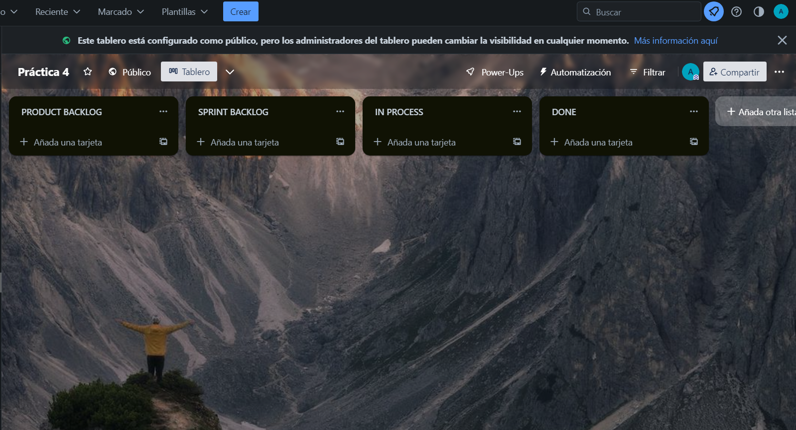
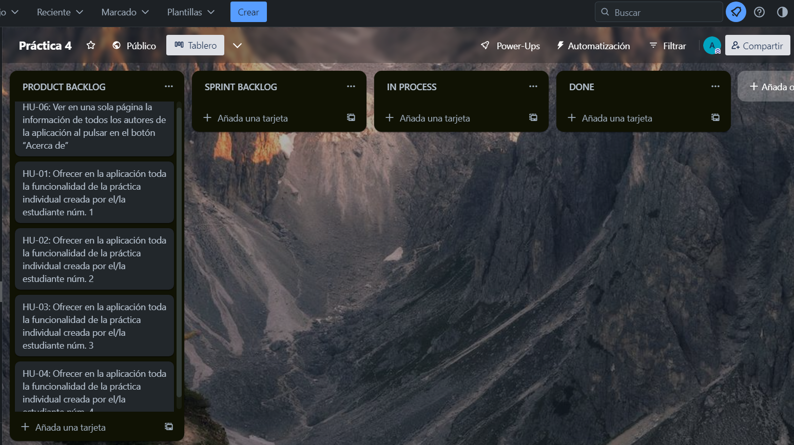
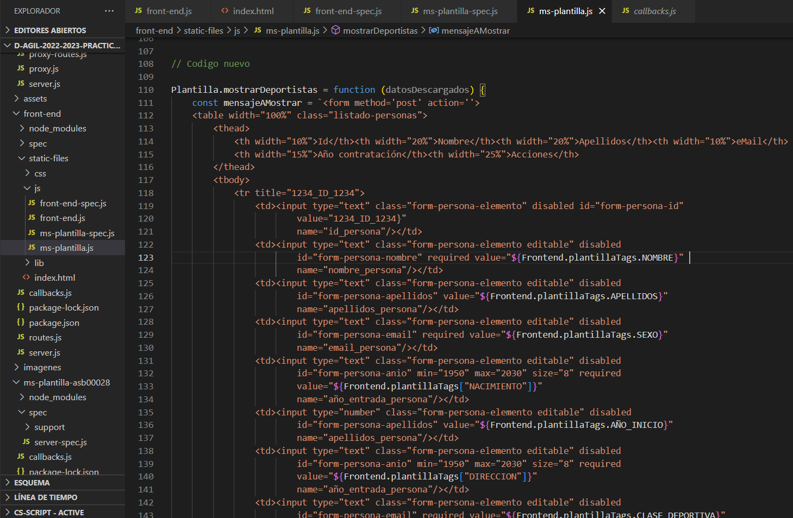
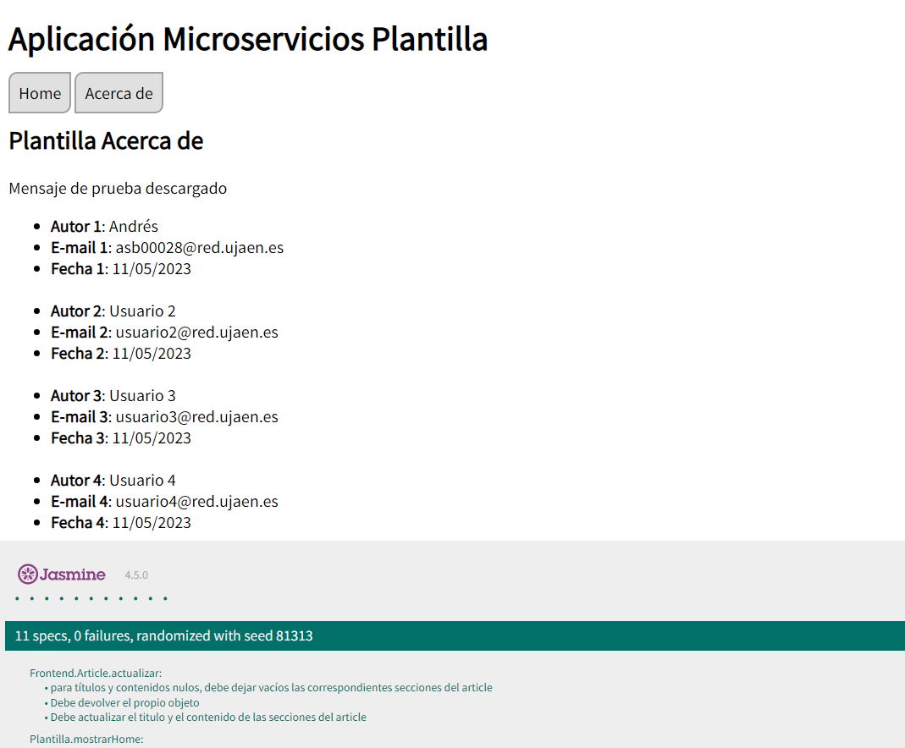

## Tablero Trello

https://trello.com/b/LyGkuN4w/pr%C3%A1ctica-4

## Información de los estudiantes:

Estudiante 1:
- Nombre: Andrés Serrano Barajas 
- Correo: asb00028@red.ujaen.es

Estudiante 2:
- Nombre: José Ángel Ángeles Santiago 
- Correo: @red.ujaen.es

Estudiante 3:
- Nombre: Rafael Montes Expósito 
- Correo: @red.ujaen.es

Estudiante 4:
- Nombre: Álvaro Ramírez Díaz 
- Correo: ard00032@red.ujaen.es

## Descripción del incremento

Imagen inicial del tablero de trello creado:

Imagen del product backlog con las HU escogidas:

HU-01 terminada:

HU-06 terminada:

## Sprint Review

Lo que se ha hecho en este incremento y lo que no: Historias de usuario que se han hecho: la hu-01 y la hu-06

## Sprint Retrospective

Qué se ha hecho bien, qué se debería modificar, a qué se compromete cada miembro del equipo para el próximo Sprint...

