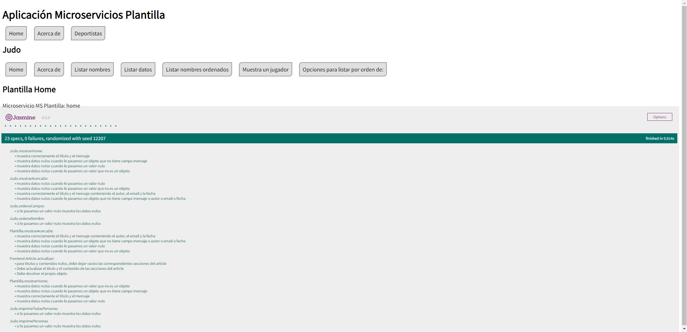
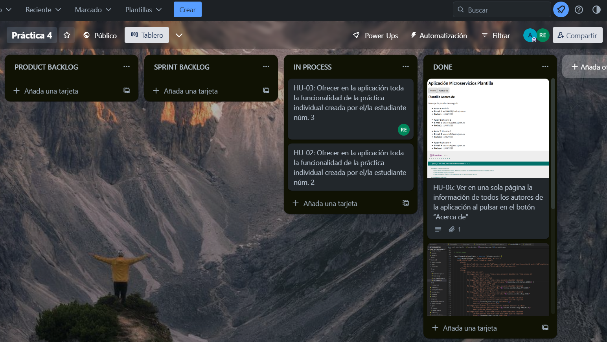

# Tablero Trello

https://trello.com/b/LyGkuN4w/pr%C3%A1ctica-4

# Información de los estudiantes:

Estudiante 1:
- Nombre: Andrés Serrano Barajas 
- Correo: asb00028@red.ujaen.es

Estudiante 2:
- Nombre: José Ángel Ángeles Santiago 
- Correo: jaas0010@red.ujaen.es

Estudiante 3:
- Nombre: Rafael Montes Expósito 
- Correo: rme00021@red.ujaen.es

Estudiante 4:
- Nombre: Álvaro Ramírez Díaz 
- Correo: ard00032@red.ujaen.es

# Descripción del incremento

Imagen inicial del tablero de trello creado:

Imagen del product backlog con las HU escogidas:

HU-01 terminada:

HU-06 terminada:

HU-04 terminada:

Tablero de trello al final:

# Sprint Review

Lo que se ha hecho en este incremento y lo que no.

Historias de usuario que se han hecho: hu-01, hu-06, hu-04

Historias de usuario que No se han hecho: hu-03, hu-02
Las historias de usuario 02 y 03 debian de haber sido hechas por los estudiantes 2 y 3 (en la parte superior del readme se encuentra la enumeración de cada estudiante), pero por cuestión de tiempo y dificultad en la implementación del código, no se han podido llevar a cabo.

# Sprint Retrospective

Qué se ha hecho bien, qué se debería modificar, a qué se compromete cada miembro del equipo para el próximo Sprint...

La elección de historias de usuario se eligieron rápidamente por los integrantes del grupo y no hubo quejas sobre las historias de usuario, por lo que la relación entre participantes fue adecuada durante todo el sprint.

Ha faltado un poco de coordinación en el grupo, ha faltado más ramas en el repositorio para que cada uno supiera lo que estaba haciendo cada uno de nuestros compañeros.

Ha faltado mas comunicación interna en el equipo. Aunque hemos tenido una aptitud muy positiva a ayudarnos mutuamente.

Durante esta sprint, hemos logrado completar las tareas asignadas dentro del marco de tiempo establecido. Sin embargo, hemos enfrentado algunos obstáculos y retrasos en el camino, lo que nos ha llevado a tener que ajustar nuestras metas y prioridades en varias ocasiones.

